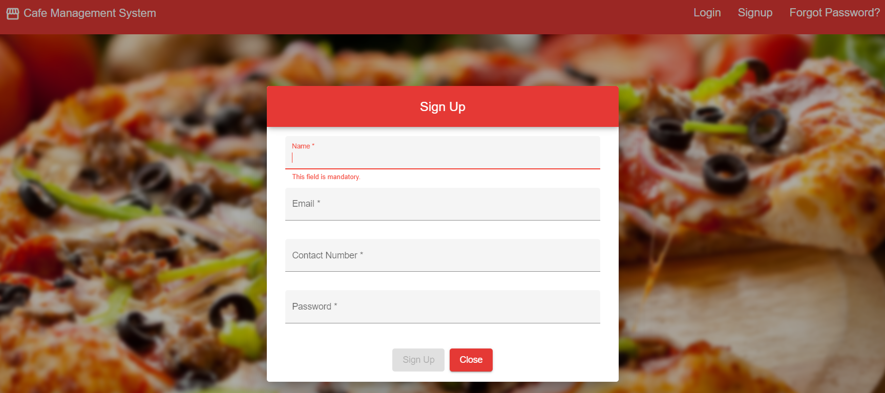
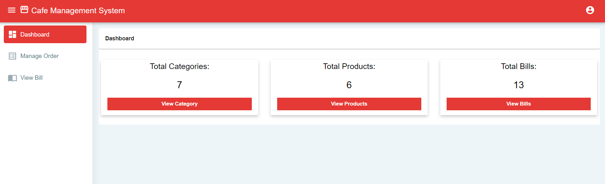
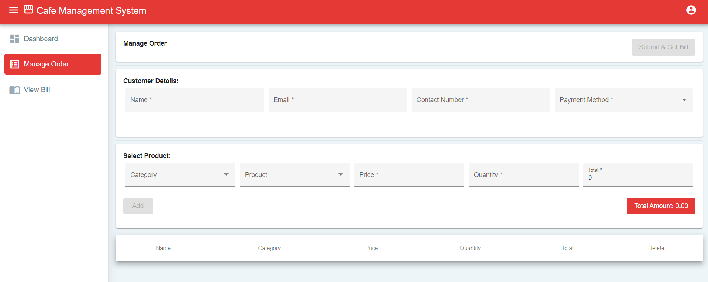
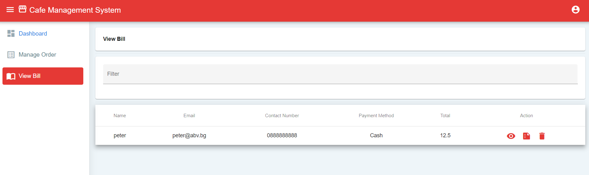
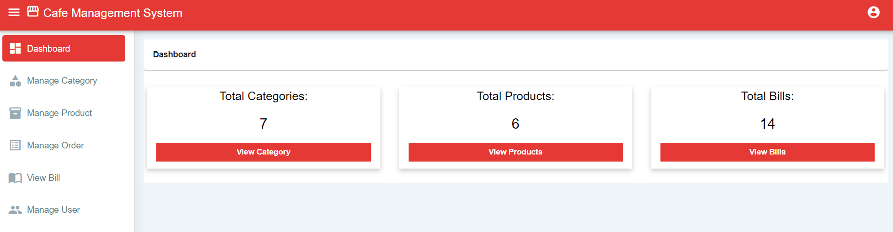
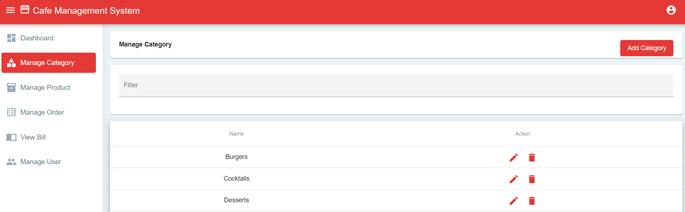
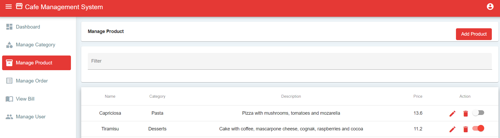
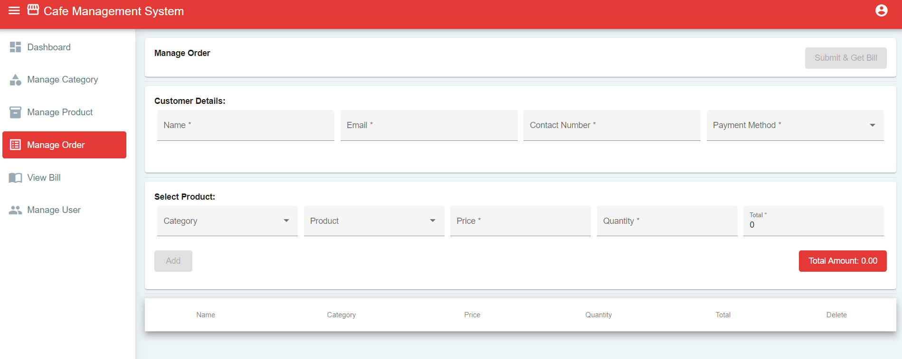
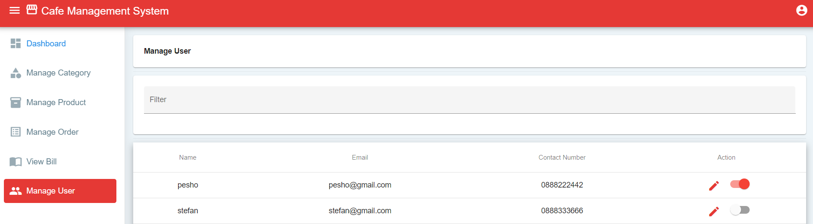
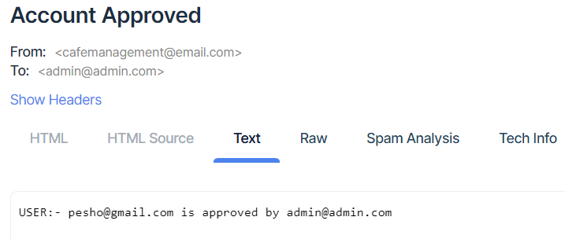

<h1 align="center">Cafe Management System</h1>

Cafe Management System is an app for creating and processing customer orders and managing employees. It's purpose is to be used internally
by the cafe's employees.

<h2>Built using:</h2>

MySQL, Spring Boot, Angular 11, Java

<h2>Landing Page</h2>

  

<h2>Sign up</h2>

  

<h2>Logged as User</h2>

Dashboard

  

Manage Order

  

View Bill

  

<h2>Logged as Admin</h2>

Dashboard

  

Manage Category

  

Manage Product

  

Manage Order

  

Manage User

  

<h2>Application Summary</h2>

-Security, User Authentication, Authorization and Role Management is handled by Spring Security + JWT  
-Single Page Application, Frontend Framework is Angular  
-Responsive design achieved through Angular Material and SCSS  

<h2>Functionality</h2>
-Users can Register/Login/Logout  
-Registered users may have one of the following roles: User, Admin  
-User roles can be managed from the application by Admins  
-Users and administrators can edit their usernames  
-Users and administrators can change their password  
-Users can reset their password by using the 'Forgot Password' functionality  
-Administrator can edit and enable/disable users  
 
-Users and Admins can create orders and generate receipts  
-Users and Admins can delete orders  
-Users can only view, download and delete receipts for orders handled by them  
-Admin has access to all receipts and can view, download and delete them  
-Admin can edit and delete categories  
-Admin can edit, delete and enable/disable products  

<h2>Emails</h2>
-When admin enables/disables user, all admins get notified by email (same functionality for disable)  

  

-When user forgets their password, he receives an email with temporary password with which he can login and change his password  
-A cron job, scheduled to run every 10 minutes notifies admins about inactive users  

<h2>Documents</h2>
-Admins and Users can generate receipt documents in .pdf format  

<h2>Error Handling and Data Validation</h2>
-Displaying appropriate messages to users when an error occurs  
-Displaying appropriate validation errors in case form data is invalid  

<h2>Interceptors</h2>
-Added preHandle and postHandle Interceptors, who serve a reporting purpose and log basic data about requests and responses

<h2>Data Management</h2>
-Spring Data JPA with MySQL

<h2>Backend Dependencies</h2>
-lombok  
-jjwt  
-itextpdf  
-spring-boot-starter-mail  
-mapstruct  
-gson  

<h2>Frontend Dependencies</h2>
-angular material  
-angular flex-layout  
-angular forms  
-file-saver  
-jwt-decode  
-ngx-ui-loader  
-rxjs  
-tslib  

<h2>Unit and Integration tests</h2>
<h3>used:</h3>
-spring-boot-starter-test  
-h2 database  
-spring-security-test  
-mockito-core  
-junit-jupiter-api  
-junit-jupiter-engine  

<h1>Instructions:</h1>

To run the application locally don't forget to edit the application.properties file of the Java Spring Boot Application

Also note, that the used version of Angular is 11, so you may need to downgrade.

If you keep getting errors when running npm install, try deleting the package-lock.json file and run npm install --legacy-peer-deps

